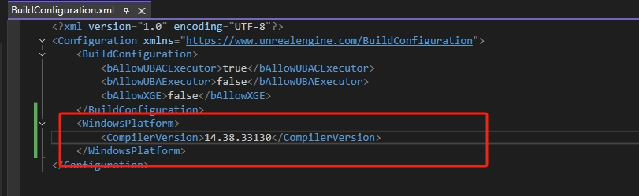

# Build Environment Preparation Guide

## 1. UE5.5 Source Code
- URL: [https://github.com/EpicGames/UnrealEngine](https://github.com/EpicGames/UnrealEngine)

---

## 2. Recommended IDEs
| Operating System | Recommended IDE |
|------------------|------------------|
| Windows          | VS2022 (MSVC14.41.34120)|
| MacOS            | Xcode            |
| Linux            | VSCode           |

---

## 3. Third-party Library Dependencies

> Although precompiled static libraries are provided in the project, it is still recommended to compile them yourself for better compatibility.

### 3.1 hiredis
- URL[https://github.com/redis/hiredis](https://github.com/redis/hiredis)

### 3.2 redis-plus-plus
- URL: [https://github.com/sewenew/redis-plus-plus](https://github.com/sewenew/redis-plus-plus)

### 3.3 QtBase
- URL: [https://github.com/qt/qtbase](https://github.com/qt/qtbase)

---

## 4. Project Placement Path

Copy the current project to the following directory within the UE source code:

```
Engine/Source/Programs/XiaoBuild
```

---

## 5. UnrealBuildAccelerator Source Code Modifications

### 5.1 Modify `UbaNetworkServer`

Path: `UnrealBuildAccelerator/Common/Public/UbaNetworkServer`

#### Add function declaration (inside `public` section):

```cpp
void DisconnectClient(const u32 InClientId);
```

#### Add function implementation:

```cpp
void NetworkServer::DisconnectClient(const u32 InClientId)
{
    SCOPED_WRITE_LOCK(m_connectionsLock, lock);
    for (auto& Con : m_connections)
    {
        if (Con.m_client && Con.m_client->id == InClientId)
        {
            Con.Disconnect();
            break;
        }
    }
}
```

---

### 5.2 Modify `UbaSession`

Path: `UnrealBuildAccelerator/Common/Public/UbaSession`

- Change the access specifier of `StartTrace` and `StopTrace` from `protected` to `public`.

---

### 5.3 Modify `UbaSessionServer`

Path: `UnrealBuildAccelerator/Common/Public/UbaSessionServer`

- Change the access specifier of the following from `protected` to `public`:
  - Functions `HandleMessage` / `OnDisconnected`
  - Macro `UBA_SESSION_MESSAGE(x)`
  - Struct `ClientSession`

#### Add function declarations:

```cpp
const Vector<ClientSession*>& GetClientSessions();
void ReEnqueueProcess(const ProcessHandle& InProcessHandle);
```

#### Add function implementations:

```cpp
const Vector<SessionServer::ClientSession*>& SessionServer::GetClientSessions()
{
    return m_clientSessions;
}

void SessionServer::ReEnqueueProcess(const ProcessHandle& InProcessHandle)
{
    ScopedCriticalSection queueLock(m_remoteProcessAndSessionLock);
    if (RemoteProcess* remoteProcess = (RemoteProcess*)InProcessHandle.m_process)
    {
        remoteProcess->m_clientId = ~0u;
        remoteProcess->m_sessionId = 0;
        remoteProcess->m_executingHost.clear();
        ProcessRemoved(remoteProcess->m_processId);
    }
    m_queuedRemoteProcesses.push_front(InProcessHandle);
}
```

---

### 5.4 Modify `UbaScheduler`

Path: `UnrealBuildAccelerator/Common/UbaScheduler`

#### Add function declaration:

```cpp
size_t GetTotal();
```

#### Add function implementation:

```cpp
size_t Scheduler::GetTotal()
{
    SCOPED_READ_LOCK(m_processEntriesLock, lock);
    return m_processEntries.size();
}
```

---

## 6. Initialize the UE Project

Run the following scripts to download dependencies and generate project files:

```bash
Setup.bat (or Setup.sh)
GenerateProjectFiles.bat (or GenerateProjectFiles.sh)
```

---

> ✅ After completing the above steps, you are ready to build and develop your XiaoBuild project.

## ⚠️ If you encounter the following error during compilation ##

1. error LNK 2019: unresolved external symbol _Cnd_timewait_for  referenced in function "public: bool __cdecl std::condition_variable::wait_for


    Resolution:The MSVC version can be aligned with 14.38.33130.
