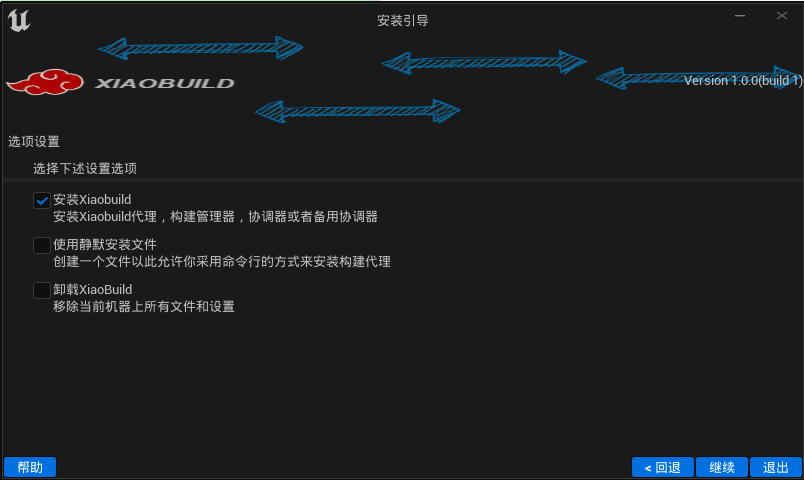
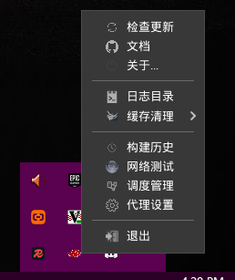
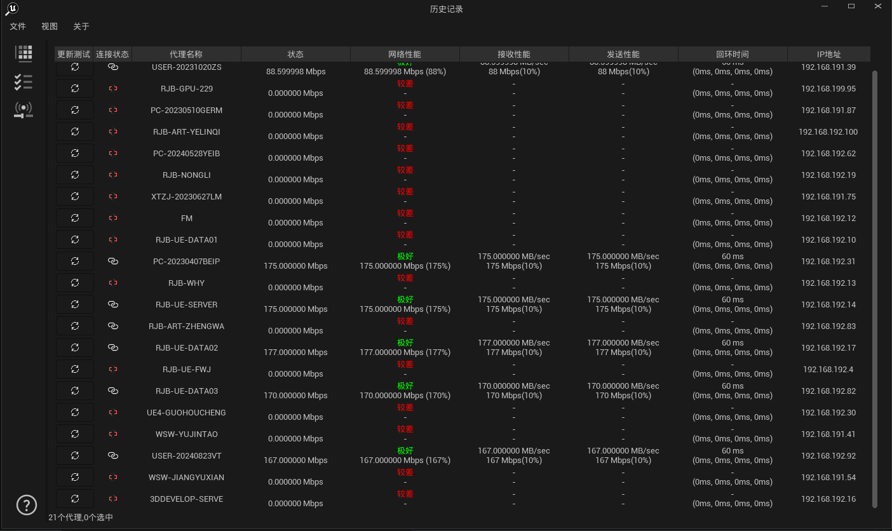
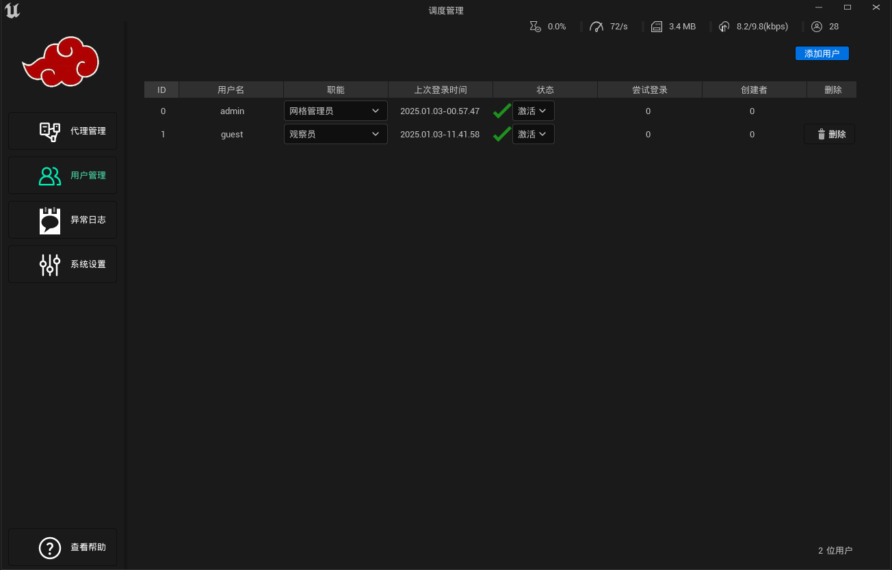
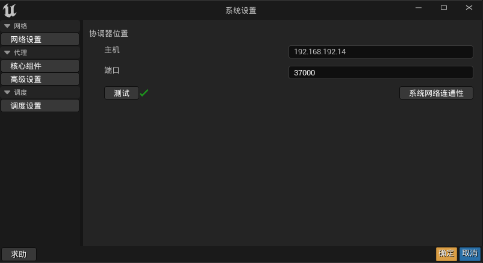

# XiaoBuild

## Introduction

> This software is primarily developed based on UE5.5's UBA, designed for the Unreal Engine development process. It aims to enhance user efficiency and experience in source code compilation and material compilation, providing the standard functionalities of IncrediBuild.

---

## Version Information

Current Version：v1.0.7
Release Date: ：2025-04-17

---

## Engine Support

| Engine Version     | Source Compilation | Material Compilation  |
|--------------------|--------------------|-----------------------|
| 4_26    | ✔        | ✔       |
| 4_27    | ✔        | ✔       |
| 5_0     | ✔ [▶️](https://youtu.be/H8qjjH1VbRo?si=YAnu5DE9qh3JFa5M&t=73)      | ✔       |
| 5_1     | ✔ [▶️](https://youtu.be/Id_Khmcypw0?si=yDGeibHtfjDIBHyH&t=191)      | ✔       |
| 5_2     | ✔ [▶️](https://youtu.be/gRwpNMGWrb4?si=EIRa0z3PNzHSqsWE&t=167)      | ✔       |
| 5_3     | ✔ [▶️](https://youtu.be/6dNMNT_D8Ts?si=JITDGahkYgP6MSVj&t=56)      | ✔       |
| 5_4     | ✔ [▶️](https://youtu.be/WxD754CTsPE?si=-EcJWkgddUdlma5j&t=95)      | ✔       |
| 5_5     | ✔ [▶️](https://youtu.be/QL_PEHftOOs?si=-QcaSyq6IM7EdPRT&t=152)      | ✔       |

## Table of contents

- [XiaoBuild](#xiaobuild)
  - [Introduction](#introduction)
  - [Version Information](#version-information)
  - [Engine Support](#engine-support)
  - [Table of contents](#table-of-contents)
  - [Features](#features)
  - [System Requirements](#system-requirements)
  - [Installation Guide](#installation-guide)
  - [User Manual](#user-manual)
    - [1.Installing and Configuring the Tool](#1installing-and-configuring-the-tool)
    - [2.Tray Tool](#2tray-tool)
    - [3.Real-time Build Insight Tool](#3real-time-build-insight-tool)
    - [4.Build Coordinator Tool](#4build-coordinator-tool)
    - [5.Agent Settings Tool](#5agent-settings-tool)
  - [QA](#qa)
    - [The project gets stuck at 45% during material compilation, and the progress does not change for a long time?](#the-project-gets-stuck-at-45-during-material-compilation-and-the-progress-does-not-change-for-a-long-time)
    - [Sometimes the agent exceeds the maximum number of concurrent processes set by the system?](#sometimes-the-agent-exceeds-the-maximum-number-of-concurrent-processes-set-by-the-system)
    - [Backup Machine Setup](#backup-machine-setup)
  - [Changelog](#changelog)
    - [v1.0.0](#v100)
  - [License Agreement](#license-agreement)
  - [Contact Us](#contact-us)

---

## Features

Main functionalities of the software:

- Unified compilation of Unreal Engine source code and materials
- Does not require UE Engine installation for operation
- Real-time monitoring of source code and material compilation
- Configurable system and agent parameters to dynamically allocate and release computing resources, maximizing resource utilization
- Supports Unreal Engine versions from 4.26 to 5.5, with one-click installation for both source-built and launcher (binary) versions.
- User-friendly interface, requiring no specialized knowledge

Complete UE5_1 build process: 
https://www.bilibili.com/video/BV1dCr3YqExS/?spm_id_from=333.999.0.0&vd_source=e4b1cc7dae1637f7c09704300ea43634

---

## System Requirements

Description of the software's runtime environment and hardware requirements:

- **Operating System**：x64 Windows 10/11
  
- **Hardware Requirements**：

  - CPU: i5
  - Memory：4GB
  - Storage: Recommended 10GB+ SSD

- **System Architecture**：
  XiaoBuild consists of two machine types: Agent and Coordinator.

---

## Installation Guide

Detailed steps for software installation:

1. Download the installation package：[Download Link](https://github.com/Ghost2020/XiaoBuild/releases)
2. Double-click the installation file and follow the prompts to complete the installation.
3. If you have installed "Certain 360" and similar antivirus software such as Computer Manager, make sure to allow the installation.
4. Configure environment variables (if needed).
5. Launch the software for initial setup.

---

## User Manual

Step-by-step instructions on how to use the software's main features:

### 1.Installing and Configuring the Tool

**Step1::Initial Launch Screen**

**Step2::Agreement Terms**

**Step3::Installation Type**

`Option 1`::Recommended for most cases.

`Option 2`::Automated installation via a configuration file.

`Option 3`::Uninstallation process.

---

**Step4::Component Installation**

`Agent`::Registers the installation of an agent service, which can initiate collaborative compilation tasks and also act as an agent to accept collaborative compilation requests from other initiators. (It is recommended to install the Network type first when configuring the system.)

`Network`::(Mainly a service program) In addition to the agent installation, it will also register and install the scheduler service, which synchronizes all agent data and distributes build tasks based on this data.

`Custom`::Allows further selection of installation components.

---

**Step5::Agent Installation - Setting the Scheduler Location**

`Network Address` The Network Address is the IP address of the scheduler machine. After setting it, you can click the test button to check if network communication is normal.

**Step6 Setting the Network Port for Agent Service**

Unless the port is occupied, the default setting is recommended.

**Step7 Selecting Unreal Engine Versions for Collaborative Compilation**

`Agent Cas Directory` The Agent Cas Directory is used to store cache data files for the UBA system. Since it has high I/O requirements, it is best to place it on an SSD with at least 10GB of available storage.

`The table above shows which Unreal Engine versions are installed on the machine, whether they are source or public versions, and whether collaborative compilation support is installed. (After installation, additional Unreal Engine versions can be dynamically uninstalled and installed as needed.)`

---

**Step5::Network Installation - Scheduler Setup**

The ports listed above are required for the scheduling and web services. The default settings are recommended, but if they are occupied, alternative ports can be tested.

---

### 2.Tray Tool

`The Tray Tool serves as the management entry point for other utility programs.`

### 3.Real-time Build Insight Tool

The main functions of build progress monitoring:

1. **Real-time Build Progress Monitoring**

2. **Viewing Historical Build Progress**

3. **Agent Connectivity Testing**

### 4.Build Coordinator Tool

**Function 1**：View and adjust agent parameters in the system to allocate computing resources.

 **Function 2**: Basic user management mechanism where administrators have full permissions to modify system parameters, while observers can only view them.

**Function 3**：View system errors synchronized into the system.

---

### 5.Agent Settings Tool

  **Main Function**：Configuring agent system parameters.

---

## QA

### The project gets stuck at 45% during material compilation, and the progress does not change for a long time?

In this case, the XiaoScheduler program has crashed. Restarting the program should resolve the issue.

### Sometimes the agent exceeds the maximum number of concurrent processes set by the system?

This is a bug in the UBA scheduling system. It will be addressed in future updates. (A temporary excess of processes will not significantly impact system performance.)

### Backup Machine Setup

After the network service is installed and registered, choose a stable machine with sufficient storage and follow the normal installation process. However, select `Custom Installation` type and choose the `Backup Server` option.

---

## Changelog

Documenting software version updates:

### v1.0.9

- Basic functionality equivalent to IncrediBuild

---

## License Agreement

A brief description of the software license, or a link to the full license agreement:

> This software follows the MIT License. For details, please [refer to](.COPYRIGHT).

---

## Contact Us

Providing user support contact information:

- **Email**：cxx2020@outlook.com
- **QQ**：794569465
- **QQ Group**：910420853
- **WeChat**：c794569465

