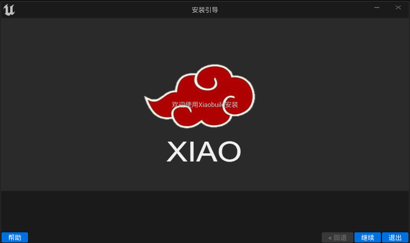
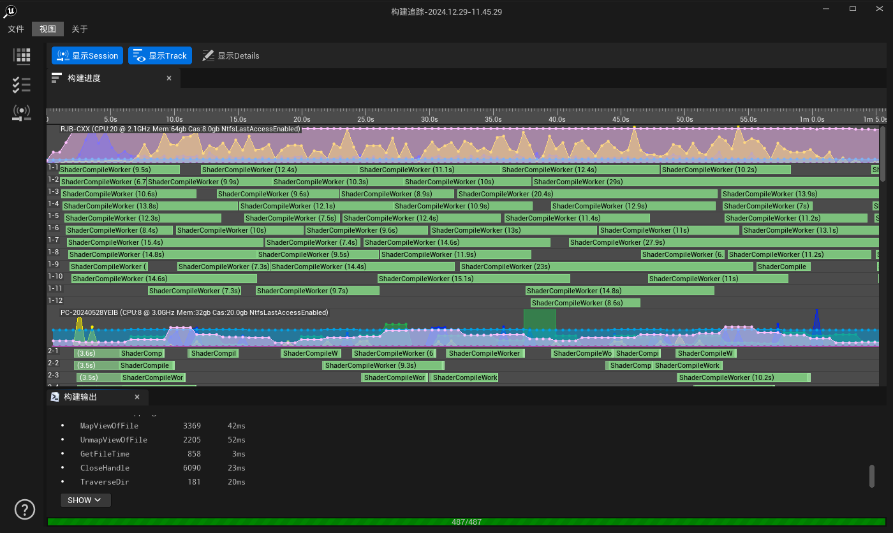

# XiaoBuild

## 版本信息

当前版本：v1.0.0
发布日期：2025-01-03

---

## 目录

- [XiaoBuild](#xiaobuild)
  - [版本信息](#版本信息)
  - [目录](#目录)
  - [简介](#简介)
  - [功能特点](#功能特点)
  - [系统要求](#系统要求)
  - [安装指南](#安装指南)
  - [使用说明](#使用说明)
    - [安装配置工具](#安装配置工具)
    - [构建实时分析工具](#构建实时分析工具)
    - [构建协调器工具](#构建协调器工具)
    - [代理设置工具](#代理设置工具)
  - [常见问题](#常见问题)
    - [问题1](#问题1)
    - [问题2](#问题2)
  - [更新日志](#更新日志)
    - [v1.0.0](#v100)
  - [许可协议](#许可协议)
  - [联系我们](#联系我们)

---

## 简介

简要介绍软件的用途、目标用户及核心价值。例如：

> 本软件是一款用于XXXX的工具，旨在提高用户在XXXX方面的效率和体验。

---

## 功能特点

列出软件的主要功能：

- **功能1**：简要描述
- **功能2**：简要描述
- **功能3**：简要描述

---

## 系统要求

描述软件的运行环境和硬件要求：

- **操作系统**：Windows 10/11
- **硬件需求**：
  - CPU：XXXX
  - 内存：4GB
  - 存储空间：10GB SSSD
- **其他依赖**：如需要特定的软件或库

---

## 安装指南

详细说明软件的安装步骤：

1. 下载安装包：[下载链接](https://github.com/Ghost2020/XiaoBuild/releases)
2. 双击安装文件并按照提示完成安装。
3. 配置环境变量（如有需要）
4. 启动软件进行初始化设置。

---

## 使用说明

分步骤说明如何使用软件的主要功能：

### 安装配置工具

1. **操作步骤1**：XXXX
2. **操作步骤2**：XXXX

### 构建实时分析工具

1. **操作步骤1**：XXXX
2. **操作步骤2**：XXXX

### 构建协调器工具

1. **功能1**：XXXX
2. **功能2**：XXXX

### 代理设置工具

1. **功能1**：XXXX
2. **功能2**：XXXX

---

## 常见问题

回答用户可能会遇到的问题：

### 问题1

描述问题及解决方案。

### 问题2

描述问题及解决方案。

---

## 更新日志

记录软件的版本更新内容：

### v1.0.0

- 功能1
- 修复了问题X

---

## 许可协议

简要描述软件的使用许可，或附上完整的许可协议链接：

> 本软件遵循XXXX许可协议，详情请参阅[协议链接](#)。

---

## 联系我们

提供用户支持的联系方式：

- **邮箱**：cxx2020@outlook.com
- **官网**：[www.xiaobuild.com](#)
- **QQ**：794569465
- **微信**：c794569465 

