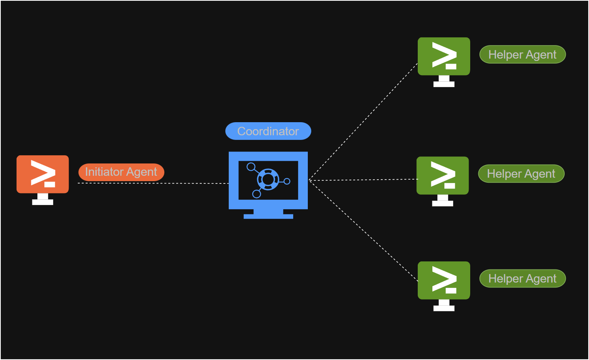

# XiaoBuild

## 简介

> 本软件主要基于UE5.5的UBA开发，用于UnrealEngine开发过程中，旨在提高用户在源码编译和材质编译方面的效率和体验，具备IncrediBuild的常规功能。

---

## 版本信息

当前版本：v1.1.1
发布日期：2025-08-10

---

## 引擎支持情况

| 引擎版本 | 源码编译 | 材质编译  |
|---------|----------|----------|
| 4_26    | ✔ [▶️](https://www.bilibili.com/video/BV1rSbKz5EqT/?share_source=copy_web&vd_source=13d934120a59d113eda5c8f73bff2c65)       | ✔      |
| 4_27    | ✔ [▶️](https://www.bilibili.com/video/BV1N6bKzHEoX/?share_source=copy_web&vd_source=13d934120a59d113eda5c8f73bff2c65)       | ✔[▶️](https://www.bilibili.com/video/BV1Beu4z7E9U/?share_source=copy_web&vd_source=13d934120a59d113eda5c8f73bff2c65)      |
| 5_0     | ✔ [▶️](https://www.bilibili.com/video/BV1p9cieiEQc/?share_source=copy_web&vd_source=13d934120a59d113eda5c8f73bff2c65)      | ✔       |
| 5_1     | ✔ [▶️](https://www.bilibili.com/video/BV1dCr3YqExS/?share_source=copy_web&vd_source=13d934120a59d113eda5c8f73bff2c65)      | ✔       |
| 5_2     | ✔ [▶️](https://www.bilibili.com/video/BV1k9cieiEdQ/?share_source=copy_web&vd_source=13d934120a59d113eda5c8f73bff2c65)      | ✔       |
| 5_3     | ✔ [▶️](https://www.bilibili.com/video/BV1C9cieiEV8/?share_source=copy_web&vd_source=13d934120a59d113eda5c8f73bff2c65)      | ✔       |
| 5_4     | ✔ [▶️](https://www.bilibili.com/video/BV1p9cieiEsZ/?share_source=copy_web&vd_source=13d934120a59d113eda5c8f73bff2c65)      | ✔       |
| 5_5     | ✔ [▶️](https://www.bilibili.com/video/BV1p9cieiEyc/?share_source=copy_web&vd_source=13d934120a59d113eda5c8f73bff2c65)      | ✔       |
| 5_6     | ✔       | ✔       |

## 目录

- [XiaoBuild](#xiaobuild)
  - [简介](#简介)
  - [版本信息](#版本信息)
  - [引擎支持情况](#引擎支持情况)
  - [目录](#目录)
  - [功能特点](#功能特点)
  - [系统要求](#系统要求)
  - [安装指南](#安装指南)
  - [使用说明](#使用说明)
    - [一.安装配置工具](#一安装配置工具)
    - [二.托盘工具](#二托盘工具)
    - [三.构建实时分析工具](#三构建实时分析工具)
    - [四.构建协调器工具](#四构建协调器工具)
    - [五.代理设置工具](#五代理设置工具)
  - [常见问题](#常见问题)
    - [启动项目之后卡在%45编译材质，进度久久没有变化?](#启动项目之后卡在45编译材质进度久久没有变化)
    - [通过构建进度查看工具会发现，有时代理会超过系统设置的最大同时能运行的进程数?](#通过构建进度查看工具会发现有时代理会超过系统设置的最大同时能运行的进程数)
    - [备份机器](#备份机器)
  - [更新日志](#更新日志)
    - [v1.0.0](#v100)
  - [许可协议](#许可协议)
  - [联系我们](#联系我们)

---

## 功能特点

软件的主要功能：

- UnrealEngine源码、材质联合编译
- 系统的运行并不要求安装UE引擎
- 实时查看源码、材质编译的过程
- 通过配置系统和代理的参数，使调度系统动态获取释放计算资源，充分利用系统中的计算资源
- 4.26-5.6无论公版/源码版本一键安装全支持
- 对于用户使用相对友好，无须专业知识

构建UE5_1全过程 
https://www.bilibili.com/video/BV1dCr3YqExS/?spm_id_from=333.999.0.0&vd_source=e4b1cc7dae1637f7c09704300ea43634

---

## 系统要求

描述软件的运行环境和硬件要求：

- **操作系统**：x64 Windows 10/11
  
- **硬件需求**：

  - CPU: i5
  - 内存：4GB
  - 存储空间：推荐 10GB以上 SSD

- **系统架构**：
  XiaoBuild 包含两种类型的机器：Agent 和 Coordinator。

---

## 安装指南

详细说明软件的安装步骤：

1. 下载安装包：[下载链接](https://github.com/Ghost2020/XiaoBuild/releases)
2. 双击安装文件并按照提示完成安装。
3. 如有安装"某60"和类似电脑管家等各种杀毒软件，注意允许其安装
4. 配置环境变量（如有需要）
5. 启动软件进行初始化设置。

---

## 使用说明

分步骤说明如何使用软件的主要功能：

### 一.安装配置工具

**Step1::启动界面如下**

**Step2::协议条款**

**Step3::安装类型**

`选项一`::绝大多数情况下使用第一种

`选项二`::通过配置文件自动化安装

`选项三`::卸载操作

---

**Step4::组件安装**

`代理`::将会注册安装代理服务，可以发起联合编译任务，同时也作为代理接受其他发起者的联合编译请求(建议首次配置系统时,先安装 `网络` 类型)

`网络`::(主要是服务程序)在代理安装的基础上还会额外注册安装调度器服务，调度器服务用于同步所有代理的各种数据，在此数据基础上用于分发构建任务。

`自定义`::可以选择进一步细化安装的组件

---

**Step5::代理安装-确定调度器的位置**

`网络地址` 是调度器所在机器的ip地址，设置之后，可以点击测试按钮是否网络通讯是否通常

**Step6 确定代理服务的网络端口**

除非提示端口被占用，一般情况下使用默认的就好

**Step7 确定哪些UE引擎需要安装联合编译**

`代理Cas目录`用于存放UBA系统的缓存数据文件，对于硬盘I/O有要求，最好放在SSD盘上，空余的存储文件至少10GB是最好的

`上面的UnrealEngine的表格用显示了当前机器上装了哪些UE引擎，是源码版本还是公版引擎，以及是否安装对于联合编译的支持，(安装之后，后续有其他的引擎也可以通过设置来动态卸载和安装)`

---

**Step5::网络安装-调度器**

上述的各项端口是调度服务和web服务所需的，默认就好，如果被占用，可选取其他端口进行测试

---

### 二.托盘工具

`托盘工具是其他工具程序的管理入口`

### 三.构建实时分析工具

构建进度查看主要功能如下:

1. **构建进度实时查看**
   
2. **历史构建进度查看**

3. **代理连通性测试**

### 四.构建协调器工具

  **功能1**：查看，调整系统中代理的参数，用以分配计算资源

  **功能2**: 具备简单的用户管理机制，管理员具有最高权限可修改系统中各项参数，观察者，只能查看系统的各项参数

  **功能3**：查看同步到系统中异常错误 SystemSettings.png

---

### 五.代理设置工具

  **主要功能**：代理系统相关参数设置

---

## 更新日志

记录软件的版本更新内容：

### v1.0.9

- 基本具备IncreaiBuild的功能

---

## 许可协议

简要描述软件的使用许可，或附上完整的许可协议链接：

> 本软件遵循MIT License许可协议，详情请参阅[协议链接](.COPYRIGHT)。

---

## 联系我们

提供用户支持的联系方式：

- **邮箱**：cxx2020@outlook.com
- **QQ**：794569465
- **QQ群**：910420853
- **微信**：c794569465

