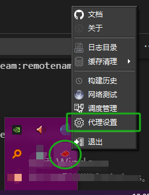
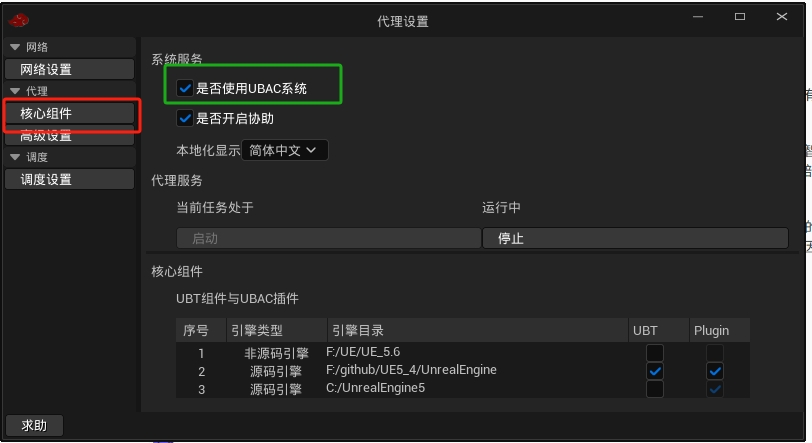
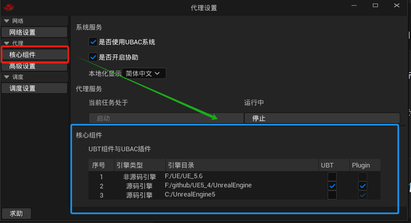
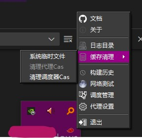
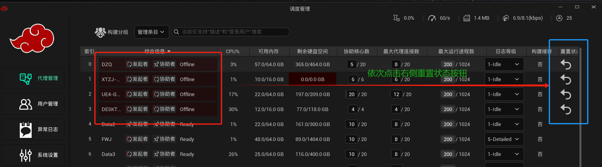

## 常见问题

### 1. 出现一些异常情况，无法使用XiaoBuild导致编译任务无法进行时?

<span style="background-color: red;">1.如果情况很紧急</span> 建议直接卸载！

如果情况一般，可以通过右下角的 托盘程序 -> 代理设置


<span style="background-color: yellow;">2.全局操作代理设置</span>  关闭UBAC系统的使用(这是全局操作，所有引擎都会影响)


<span style="background-color: blue;">3.特定引擎版本设置</span> 只影响特定引擎版本 



---

### 2. 通过构建进度查看工具会发现，有时代理会超过系统设置的最大同时能运行的进程数?

这种情况是UBA底层调度有bug，看后续是否有时间去解决(短时间内超过限制，不会机器的运行有太大的影响)

---

### 3. 备份机器

在网络服务已经运行注册安装之后，选择一台网络稳定，存储空间足够的机器按照普通安装的顺序，只是在安装类型时选择`自定义类型`，
然后在其中的选项中选择`备份服务器`类型


---

### 4. 命令行安装

例如在Windows Server 上可能是没有独立显卡，只有集成显卡，UE的Slate程序是没法显示的，再或者只能通过终端进行操作情形下 可以采用命令行方式运行安装程序。 步骤如下:

```shell
cd $XIAO_HOME%/Binaries/Win64
./XiaoInstallConsole.exe -install -install_setting=C:/ProgramData/Epic/install_setting.json -ppid=48208 -LOG=XiaoInstallConsole.log
```

-install 代表是安装 

-install_setting 指向的是一个安装配置文件的url

-ppid 指向的父进程ID 

-LOG 指定日志文件的名称


install_setting.json 文件中的内容如下:
```json 
{
    "Localization": "zh-CN",    
    "SetupUpType": 0,
    "InstallType": 7,
    "bEnableAutoTray": true,    
    "bSilentInstall": false,
    "bHasLicense": false,
    "LicenseKey": "",
    "CoordiListenPort": 37000,
    "UIListenPort": 37060,
    "PerfTransport": 37080,
    "AgentListenPort": 1345,
    "SchedulerServerPort": 1346,
    "LicenseListenPort": 37020,
    "CacheListenPort": 37040,
    "bAutoOpenFirewall": true,
    "InstallFolder": "C:/Program Files/XiaoBuild/Engine",   // 安装的目录中Engine目录所在位置
    "CacheFolder": "C:/ProgramData/XiaoBuild/Cache",        // 系统运行中缓存存放位置
    "bAddEnvironment": true,
    "bHasSSL": true,
    "CertFile": "",
    "KeyFile": "",
    "Username": "admin",    // 调度器类型需要填写,用于系统管理登录 代理类型不用填
    "Domain": ".",
    "Password": "A1234567", // 调度器类型需要填写/ 代理类型不用填
    "CoordiIp": "localhost",// 调度器类型默认"localhost" / 代理类型则填调度器安装机器所在IP地址
    "CoordiPort": 37000,    // 同上
    "HelpListenPort": 1345,
    "FileCache": 4096,
    "bInstallIDE": true,
    "EngineFolders": [],
    "EngineTypes": [],
    "EngineVersions": []
}
```
---

### 5. 登录账户和密码忘记了

可以去调度器所在机器上，查看C:/ProgramData/Epic/install_setting.json文件
里面有两个字段 "Username" 和 "Password"

---

### 6. 在安装XiaoBuild使用一段时间后硬盘空间不够了

XiaoBuild在运行的过程中会有文件进行同步，日积月累就会留下很多缓存文件

**解决方式**: 通过右下角的托盘程序可以清理一下缓存文件，缓存清理->清理调度器Cas

如何下图所示操作:



---

### 7. XiaoBuild调度管理面板上有部分代理显示处于掉线状态，但是经过检查却是对应机器上的代理程序的运行是正常的

**解决方式** 打开调度管理程序，通过面板上的按钮来重置对应的代理状态

如下图所示操作:


