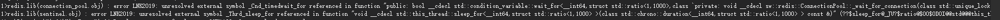
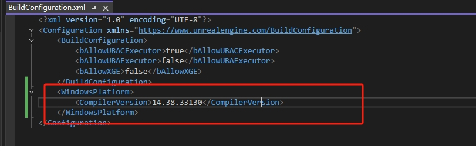

# 编译环境准备指南

## 1. UE5.5 源码
- 地址：[https://github.com/EpicGames/UnrealEngine](https://github.com/EpicGames/UnrealEngine)

---

## 2. 编译 IDE 推荐
| 操作系统 | 推荐 IDE   |
|----------|------------|
| Windows  | VS2022 VS2022 (MSVC14.41.34120)|
| MacOS    | Xcode      |
| Linux    | VSCode     |

---

## 3. 第三方库依赖

> 虽然项目中已经提供了预编译的静态库，但仍推荐自己进行编译以确保兼容性。

### 3.1 hiredis
- 地址：[https://github.com/redis/hiredis](https://github.com/redis/hiredis)

### 3.2 QtBase
- 地址：[https://github.com/qt/qtbase](https://github.com/qt/qtbase)

---

## 4. 项目放置路径

将当前项目拷贝到 UE 源码的以下目录中：

```
Engine/Source/Programs/XiaoBuild
```

---

## 5. UnrealBuildAccelerator 项目源码修改

### 5.1 修改 `UbaNetworkServer`

路径：`UnrealBuildAccelerator/Common/Public/UbaNetworkServer`

#### 添加函数声明（public 区域）：

```cpp
void DisconnectClient(const u32 InClientId);
```

#### 添加函数实现：

```cpp
void NetworkServer::DisconnectClient(const u32 InClientId)
{
    SCOPED_WRITE_LOCK(m_connectionsLock, lock);
    for (auto& Con : m_connections)
    {
        if (Con.m_client && Con.m_client->id == InClientId)
        {
            Con.Disconnect();
            break;
        }
    }
}
```

---

### 5.2 修改 `UbaSession`

路径：`UnrealBuildAccelerator/Common/Public/UbaSession`

- 将 `StartTrace` 和 `StopTrace` 函数的访问属性从 `protected` 改为 `public`

---

### 5.3 修改 `UbaSessionServer`

路径：`UnrealBuildAccelerator/Common/Public/UbaSessionServer`

- 将以下内容的访问属性从 `protected` 改为 `public`：
  - 函数 `HandleMessage` / `OnDisconnected`
  - 宏 `UBA_SESSION_MESSAGE(x)`
  - 结构体 `ClientSession`

#### 添加函数声明：

```cpp
const Vector<ClientSession*>& GetClientSessions();
void ReEnqueueProcess(const ProcessHandle& InProcessHandle);
```

#### 添加函数实现：

```cpp
const Vector<SessionServer::ClientSession*>& SessionServer::GetClientSessions()
{
    return m_clientSessions;
}

void SessionServer::ReEnqueueProcess(const ProcessHandle& InProcessHandle)
{
    ScopedCriticalSection queueLock(m_remoteProcessAndSessionLock);
    if (RemoteProcess* remoteProcess = (RemoteProcess*)InProcessHandle.m_process)
    {
        remoteProcess->m_clientId = ~0u;
        remoteProcess->m_sessionId = 0;
        remoteProcess->m_executingHost.clear();
        ProcessRemoved(remoteProcess->m_processId);
    }
    m_queuedRemoteProcesses.push_front(InProcessHandle);
}
```

---

### 5.4 修改 `UbaScheduler`

路径：`UnrealBuildAccelerator/Common/UbaScheduler`

#### 修改函数访问属性：
将HandleReuseMessage函数的访问属性 从 private  改为 public:

#### 添加函数声明：

```cpp
size_t GetMaxLocalProcessors();
size_t GetTotal();
```

#### 添加函数实现：

```cpp
size_t Scheduler::GetMaxLocalProcessors()
{
	return m_maxLocalProcessors;
}

size_t Scheduler::GetTotal()
{
    SCOPED_READ_LOCK(m_processEntriesLock, lock);
    return m_processEntries.size();
}
```

### 5.4 修改 `UbaWinBinDependencyParser.h`
目前ShaderCompilerWorker.exe 中的依赖中有dxcore.dll,Win10和Win11
因此添加dxcore.dll 到常用的系统文件中，避免传送到Remote Machine，从而出现库版本不一致而导致的报错。


---

## 6. 初始化 UE 项目

运行以下脚本以下载依赖并生成项目文件：

```bash
Setup.bat (或 Setup.sh)
GenerateProjectFiles.bat (或 GenerateProjectFiles.sh)
```

---

> ✅ 完成以上步骤后，即可开始编译和开发 XiaoBuild 项目。


## ⚠️ 如果在编译过程中遇到下述错误 ##

1. error LNK 2019: unresolved external symbol _Cnd_timewait_for  referenced in function "public: bool __cdecl std::condition_variable::wait_for


    解决方案:让MSVC的工具链与14.38.33130进行对齐

